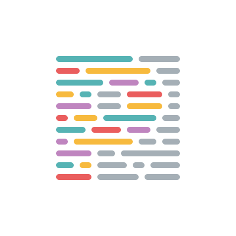
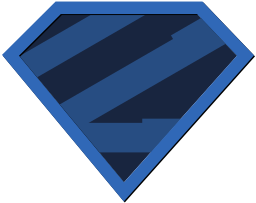
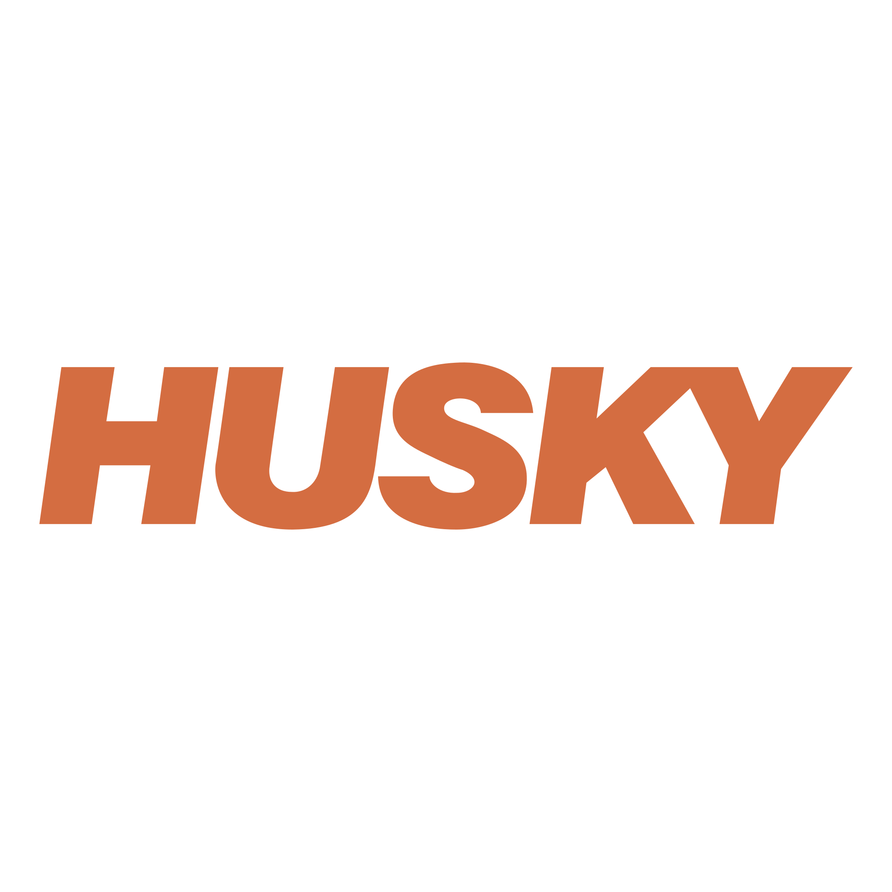

<h1>Hi👋, I'm <strong style="color: #2E86AB">Daniyar</strong> — a beginner Frontend Developer </h1>

  Passionate about building interactive web applications and constantly learning modern frontend technologies.

🌱 Currently exploring `React`, `TypeScript` and `Next.js`

🎯 Goal: become a strong Frontend Engineer and contribute to meaningful projects

---
## Contacts 📫

  <a href="https://t.me/daniyar13">  daniyar13</a>

  <a href="mailto:hapurzhonau@gmail.com">  hapurzhonau@gmail.com</a>

  <a href="https://www.linkedin.com/in/daniyar-hapurzhonau-0bb541271/"> Daniyar</a>

---

## My Tech Stack⚡

  
  
  
  
  
  
  
  
  
  
  
   
  
  
  
  
  
  
  
  

---

## 🚀 My Projects

### 👨‍💻 Personal Development
[**RS React**](https://github.com/hapurzhonau/rs-react/pulls) - Latest personal project with active pull requests and React development

### 👥 Team Collaboration
[**RIP Project**](https://github.com/AleksGoodOmens/RIP) - Collaborative team project demonstrating group development skills

---

## 🥋 Codewars Stats

